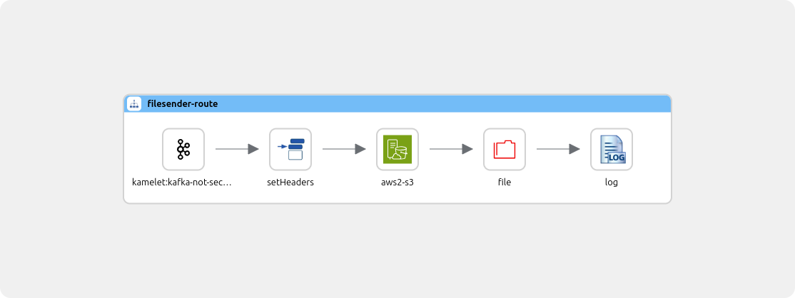

# Nextgen filesender

This camel route gets notifications from minio, downloads the file and sends it to destination.

## How-to run

Change to the kube context of the desired cluster (k3d-devt) to the camel-k namespace first.

### Local dev with kamel

Replace properties in `application.properties` with your values.

Run with

```sh
kamel run --dev  --property file:application.properties -t camel.runtime-provider=plain-quarkus file-sender.camel.yaml
```

## Export
First create ConfigMap and Secrets from the application.properties:

```
kubectl create secret generic file-sender-secret --from-env-file local-secrets.properties

kubectl create cm file-sender-cm --from-file local.properties
```

then run the integration with:

```sh
kamel run --config secret:file-sender-secret --config configmap:file-sender-cm -t camel.runtime-provider=plain-quarkus file-sender.camel.yaml
```

Now open a second terminal and run the following command:

```sh
kamel promote file-sender --to prod -o yaml > integration.yaml
```

Then apply integration.yaml to your cluster.

## Route


